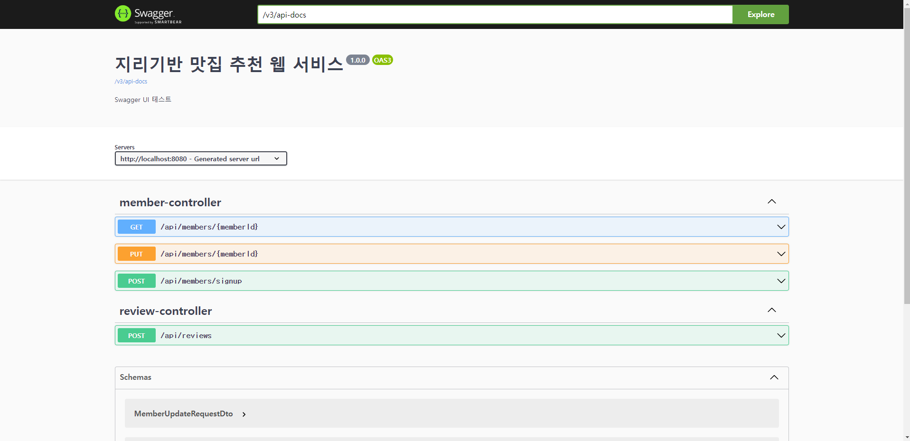
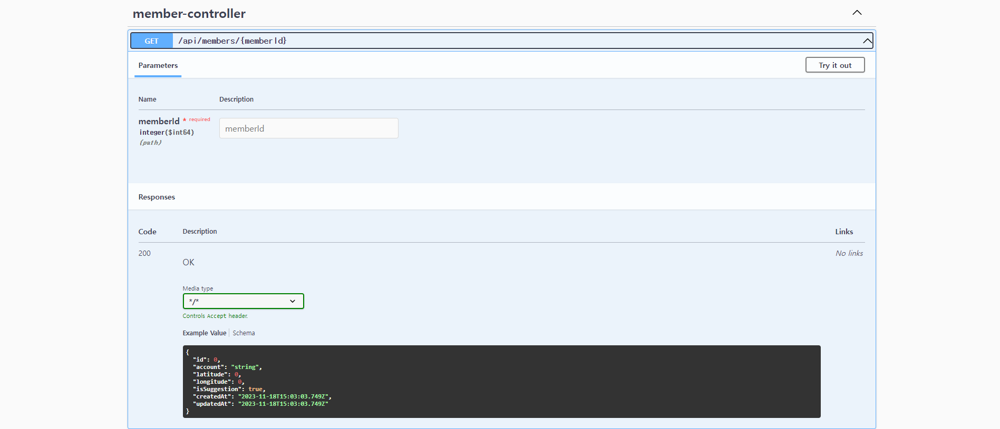
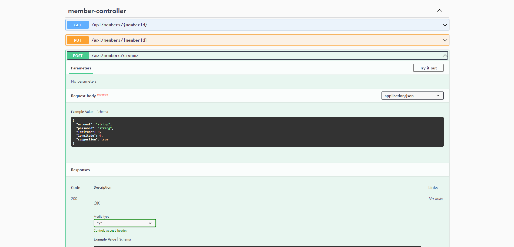
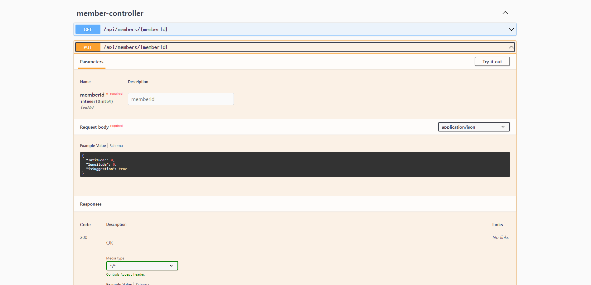
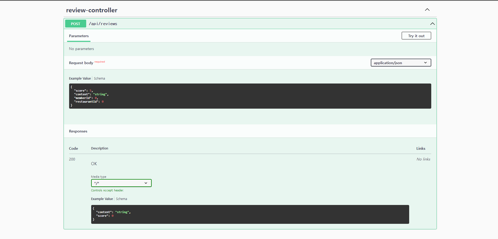
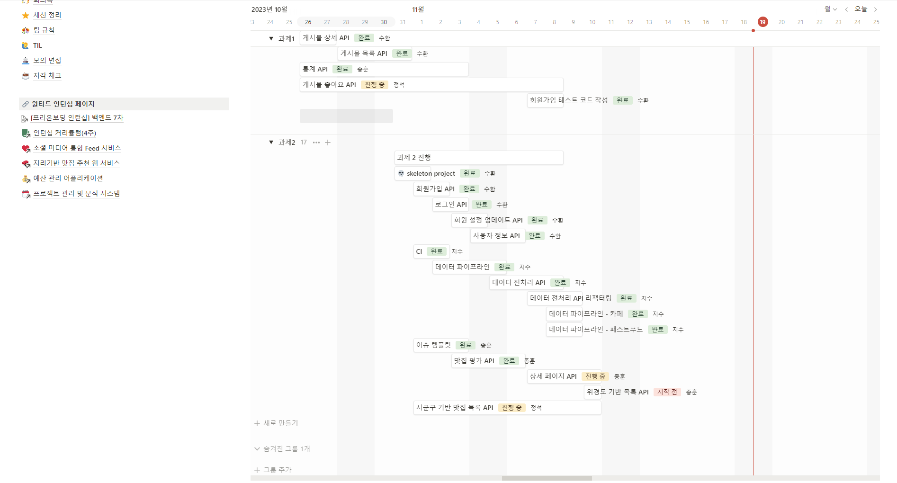

# 지리기반 맛집 추천 웹 서비스

<br/>

## Table of Contents

- [개요](#개요)
- [Skils](#skils)
- [Installation](#Installation)
- [API Reference](#api-reference)
- [프로젝트 진행 및 이슈 관리](#프로젝트-진행-및-이슈-관리)
- [구현과정(설계 및 의도)](<#구현과정(설계-및-의도)>)
- [TIL 및 회고](#til-및-회고)
- [Authors](#authors)
- [References](#references)

<br/>

## 개요

본 서비스는 공공데이터를 활용하여, 지역 음식점 목록을 자동으로 업데이트 하고 이를 활용한다. 사용자 위치에맞게 맛집 및 메뉴를 추천하여 더 나은 다양한 음식 경험을 제공하고, 음식을 좋아하는 사람들 간의 소통과 공유를 촉진하려 합니다.

**(내 위치 또는 지정한 위치 기반으로 식당 및 해당 맛집의 메뉴 를 추천한다)**


## Skils

<div align="center">

언어 및 프레임워크 <br/>   
<br/>
데이터 베이스 <br/><br/>

</div>

## Installation


```bash
  # 설치
  git clone https://github.com/Wanted-Internship-Team-Careerly/Location-Based-Foodie-Service.git
  
  # 실행
  ./gradlew build -x test
  
  # 파일위치로 이동 후
  javac LocationBasedFoodieServiceApplication.java
```

## Directory

<details>
<summary> 파일 구조 보기 </summary>

```
src
├─common
│  ├─config
│  ├─dto
│  ├─entity
│  ├─error
│  └─exception
├─member
│  ├─controller
│  ├─dto
│  ├─entity
│  ├─repository
│  └─service
├─rawrestaurant
│  ├─entity
│  ├─repository
│  └─scheduler
├─restaurant
│  ├─entity
│  ├─repository
│  └─scheduler
├─review
│  ├─controller
│  ├─dto
│  ├─entity
│  ├─repository
│  └─service
├─sigungu
│  ├─controller
│  ├─dto
│  ├─entity
│  ├─repository
│  └─service
└─util
    └─CustomResponseUtil
```

</details>
<br/>

## API Reference

Swagger : http://localhost:{port}/swagger#/

<details>

<summary>Get all posts - click</summary>





</details>

<br/>

## 프로젝트 진행 및 이슈 관리

[](https://www.notion.so/Team-Careerly-8d62334735154f7f9b9cbba91da21df5)

[프로젝트 관리 페이지](https://www.notion.so/Team-Careerly-8d62334735154f7f9b9cbba91da21df5)



<br/>

## 구현과정(설계 및 의도)

<details>
<summary>entity 설계 시 고려사항- click</summary>

- 주요 도메인으로 post, user, hashtag 로 나누기로 함
- 요구사항으로 JWT를 통해 유효성을 검증한다는 내용이 있음
  - 이에 대해 JWT와 세션을 함께 구현할까 고민하였지만 우선순위가 아니므로 추후 시간이 남으면 개발
- 좋아요 기능
  - 기존에는 post_like를 통해 user와 post에 대해 커넥션을 맺어 post_like로 좋아요를 관리하려 하였음
    - 하지만 요구사항에 좋아요 중복 허용, 좋아요 한 게시글과 같이 post_like를 필요로 하는 부분이 없었으므로 post 테이블에서 int로 like를 관리하기로 함
- post에 uuid를 사용하는 것이 요구사항에 있었음
  - 요구사항이 이렇게 정의된 것은 PK를 외부에 노출시키지 않기 위한것이라 생각되어 PK를 따로 만듦
    - PK는 해당 테이블의 고유 식별자이며 자동으로 증가하도록 값을 설정하는 것이 좋다고 생각함
- hashtag 기능
  - Post와 HashTag의 관계를 Post_Hashtag가 관리함으로써 요구사항인 hashtag에 일치하는 값만 검색되도록 구현함

</details>

<br/>

## 코드리뷰 및 에러 해결

### 로그인 회원가입
- [로그인](https://github.com/Wanted-Internship-Team-Careerly/Location-Based-Foodie-Service/pull/13)
- [회원가입](https://github.com/Wanted-Internship-Team-Careerly/Location-Based-Foodie-Service/pull/4)


### 스케쥴러 데이터 파이프라인
- [스케쥴러구현](https://github.com/Wanted-Internship-Team-Careerly/Location-Based-Foodie-Service/pull/25)
- [데이터 파이프라인](https://github.com/Wanted-Internship-Team-Careerly/Location-Based-Foodie-Service/pull/33)

### 맛집 평가
- [맛집평가](https://github.com/Wanted-Internship-Team-Careerly/Location-Based-Foodie-Service/pull/15)
- [맛집상세목록](https://github.com/Wanted-Internship-Team-Careerly/Location-Based-Foodie-Service/pull/35)

### 맛집 목록
- [맛집목록](https://github.com/Wanted-Internship-Team-Careerly/Location-Based-Foodie-Service/pull/23)

<br/>

## Authors

<div align="center">

<br/>

 </br>
<a href="https://github.com/JisooPyo">표지수</a> <a href="https://github.com/9898s">김수환</a> <br/>
<a href="https://github.com/dyori04">김정석</a> <a href="https://github.com/rivkode">이종훈</a>

</div>
<br/>

## References

- [Awesome Readme Templates](https://awesomeopensource.com/project/elangosundar/awesome-README-templates)
- [Awesome README](https://github.com/matiassingers/awesome-readme)
- [How to write a Good readme](https://bulldogjob.com/news/449-how-to-write-a-good-readme-for-your-github-project)